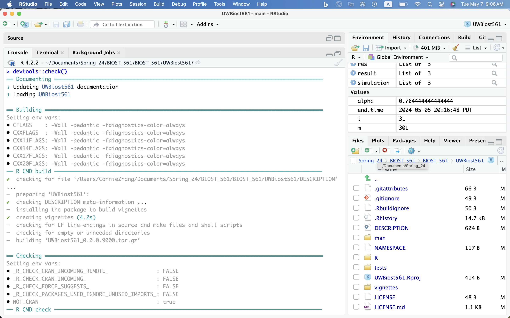
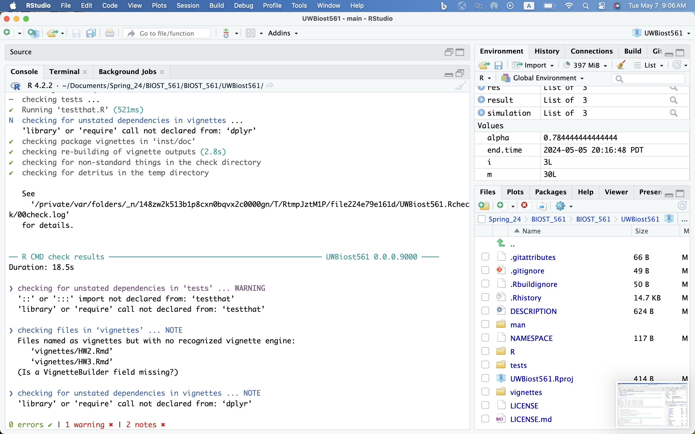

```{r setup, include=FALSE}
knitr::opts_chunk$set(echo = TRUE, warning = FALSE, message = FALSE)
```

```{r, echo=FALSE}
library(bookdown)
library(tidyverse)
library(ggplot2)
library(dplyr)
```

# Q1: Designing a function to generate random graphs with partial cliques

```{r}
source("https://raw.githubusercontent.com/linnykos/561_s2024_public/main/HW2_files/random_graph_functions.R")
# generate_random_graph
```

<u>**Question 1D**</u>

```{r}
library(UWBiost561)
set.seed(0)
simulation <- generate_partial_clique(
  n = 10,
  clique_fraction = 0.5,
  clique_edge_density = 0.9
)

simulation$adj_mat
```

# Q2: Designing a function to find the maximal partial clique

<u>**Question 2C**</u>

```{r}
set.seed(0)
simulation <- generate_partial_clique(
  n = 10,
  clique_fraction = 0.5,
  clique_edge_density = 0.9
)

adj_mat <- simulation$adj_mat

res <- compute_maximal_partial_clique(
  adj_mat = adj_mat,
  alpha = 0.9
)
res$clique_idx
res$edge_density
```

# Q3: Developing unit tests for your functions

> Nothing to report for this question. 

# Q4: Finalizing your R Package

<u>**Question 4C**</u>

```{r}


```

<u>**Question 4D**</u>

```{r}
devtools::session_info()
```

# Q5: Storyline for HW4 and final project

<u>**Question 5A**</u>

> I can access OpenSesame.

<u>**Question 5B**</u>

For the final project, I plan to work on the following tasks: 

* Find a dataset on Global Warming.
* Develop a shiny app that allows the users to choose their variables of interest and provide visualizations. 
* Include descriptions for each variable in the dataset, and list out the potential visualizations the user can choose to make with these variables. For example, it is possible to make a bar plot for a categorical and a quantitative variable. 
* If there is time, we will have a linear regression section, where the users can choose variables of interest to model global warming trends overtime. 
* Only concern is how a shiny app would display on a Pkg website. Worst case, we can just include a link to the shiny app that opens on another window. 
