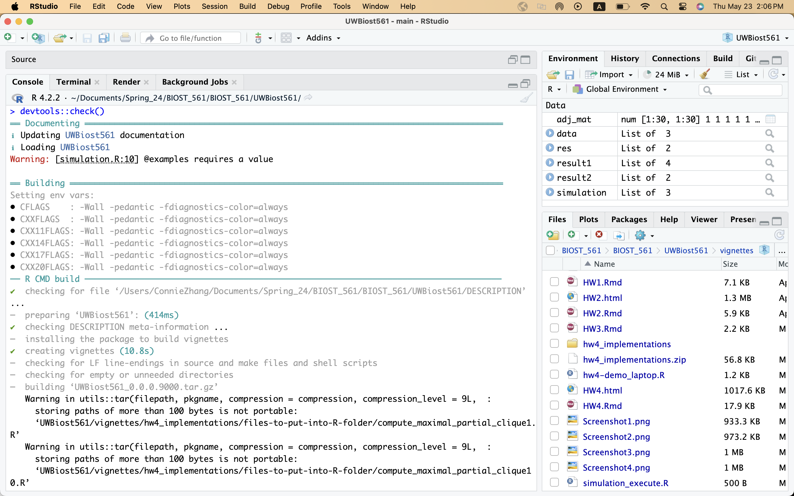
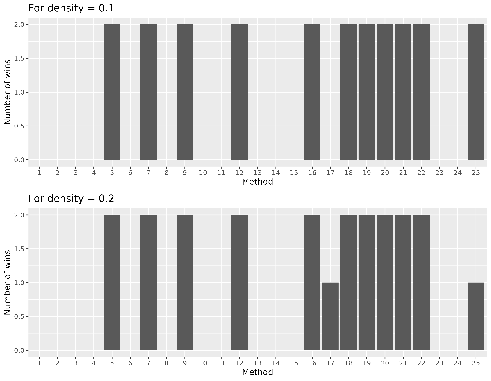

```{r setup, include = FALSE}
knitr::opts_chunk$set(
  collapse = TRUE,
  comment = "#>"
)
set.seed(10)
library(testthat)
library(UWBiost561)
library(igraph)
```

# Q1: Doing a code review of two other implementations

<u>**Question 1A**</u>: completed. 

<u>**Question 1B**</u>: Looking at two implementations you were given, summarize what you think the implementations are doing in one to four sentences each. (This is to practice reading other people's code.)

I was given implementation #1 and #6. 
Implementation #1 is an adaptation from the Bron-Kerbosch algorithm, which is a recursive algorithm to find all maximal cliques in a graph. If alpha=1, then Bron-Kerbosch algorithm is applied directly. If alpha<1, the algorithm is modified to not restrict the current node to be neighbors with the remaining nodes. The user can also choose to find the maximal partial clique using the "pivot" or "simple" method. For the pivot method, it will start iterating from the node with the maximum number of edges to other nodes. For the simple method... 

Implementation #6 iterates over each row of the matrix and checks which nodes it is connected to. If it is connected, it is then added into the cliques vector. Then the author updates the maximum density value depends on whether the clique the current row forms is bigger than the other cliques other rows form. 

<u>**Question 1C**</u>: For implementation #1, I hope the author can distinguish between the "pivot" and "simple" method more. When would be a time someone would want to use one over the other? The method should also default to either "simple" or "pivot". The author also kind of lost me at why we find the maximal cliques then have to extract the largest clique? Seems to me like the two parts can be combined? For implementation #6, there is a more abbreviated way to check conditions in the first few lines of the function. Otherwise, I think the author does a great job of providing comments in the code to explain what the code is doing. 

<u>**Question 1D**</u>: For implementation #6, it passed all the tests. For implementation 1, it passes the second test, but for the first, third, fourth, and fifth tests, the run time is too long (for both pivot and simple methods). I have commented out the first, fourth, and fifth tests due to run time issues. 

```{r, error = TRUE, cache=TRUE}
# test_that("compute_maximal_partial_clique works",{
#   set.seed(10)
#   simulation <- generate_partial_clique(
#     n = 30,
#     clique_fraction = 0.5,
#     clique_edge_density = 0.7
#   )
# 
#   adj_mat <- simulation$adj_mat
# 
#   res <- compute_maximal_partial_clique1(
#     adj_mat = adj_mat,
#     alpha = 0.7,
#     method="simple"
#   )
# 
#   expect_true(is.list(res))
#   expect_true(length(res$clique_idx)<=30)
#   expect_true(res$edge_density>=0.7)
# })

test_that("compute_maximal_partial_clique1 stops if given incorrect input",{
  set.seed(10)
  simulation <- cbind(c(1,0,2),c(0,1,0),c(2,0,1))
  simulation2 <- rep(c(1,0,1,0,1),50)

  expect_error(compute_maximal_partial_clique1(
    adj_mat = simulation,
    alpha = 0.7,
    method="simple"
  ))
  expect_error(compute_maximal_partial_clique1(
    adj_mat = simulation,
    alpha = 1.7,
    method="simple"
  ))
  expect_error(compute_maximal_partial_clique1(
    adj_mat = simulation2,
    alpha = 0.7,
    method="simple"
  ))
})

# test_that("compute_maximal_partial_clique1 takes less than 30 seconds to compute a 30 by 30 matrix",{
#   set.seed(10)
#   simulation <- generate_partial_clique(
#     n = 30,
#     clique_fraction = 0.5,
#     clique_edge_density = 0.7,
#     method="simple"
#   )
# 
#   adj_mat <- simulation$adj_mat
# 
#   start_time <- Sys.time()
#   res <- compute_maximal_partial_clique1(
#     adj_mat = adj_mat,
#     alpha = 0.7,
#     method="simple"
#   )
#   end_time <- Sys.time()
# 
#   expect_true(difftime(end_time, start_time, units = "secs") < 30)
# })

# test_that("compute_maximal_partial_clique1 work for matrices of all 1s",{
#   set.seed(10)
# 
#   simulation2 <- matrix(1, nrow = 30, ncol = 30)
# 
#   res2 <- compute_maximal_partial_clique1(
#     adj_mat = simulation2,
#     alpha = 0.7,
#     method="simple"
#   )
# 
#   expect_true(is.list(res2))
#   expect_true(length(res2$clique_idx)==30)
#   expect_true(res2$edge_density==1)
# })

# test_that("compute_maximal_partial_clique1 will find the maximal clique with edge
#           density greater than or equal to alpha",{
#   set.seed(10)
#   simulation <- generate_partial_clique(
#     n = 30,
#     clique_fraction = 0.5,
#     clique_edge_density = 0.7
#     )
#   simulation2 <- generate_partial_clique(
#     n =25,
#     clique_fraction = 0.5,
#     clique_edge_density = 0.5)
# 
#   alpha <- c(0.7,0.5)
#   res <- compute_maximal_partial_clique1(
#     adj_mat = simulation$adj_mat,
#     alpha = alpha[1],
#     method="simple"
#   )
#   res2 <- compute_maximal_partial_clique1(
#     adj_mat = simulation2$adj_mat,
#     alpha = alpha[2],
#     method="simple"
#   )
#   m <- c(length(res$clique_idx), length(res2$clique_idx))
# 
# 
#   expect_true((sum(simulation$adj_mat[res$clique_idx,res$clique_idx])-m[1])/2 >= alpha[1]*m[1]*(m[1]-1)/2)
#   expect_true((sum(simulation2$adj_mat[res2$clique_idx,res2$clique_idx])-m[2])/2 >= alpha[2]*m[2]*(m[2]-1)/2)
#   })
```

```{r}
testthat::test_that("compute_maximal_partial_clique6 works",{
  set.seed(10)
  simulation <- generate_partial_clique(
    n = 30,
    clique_fraction = 0.5,
    clique_edge_density = 0.7
  )

  adj_mat <- simulation$adj_mat

  res <- compute_maximal_partial_clique6(
    adj_mat = adj_mat,
    alpha = 0.7
  )

  expect_true(is.list(res))
  expect_true(length(res$clique_idx)<=30)
  expect_true(res$edge_density>=0.7)
})

test_that("compute_maximal_partial_clique6 stops if given incorrect input",{
  set.seed(10)
  simulation <- cbind(c(1,0,2),c(0,1,0),c(2,0,1))
  simulation2 <- rep(c(1,0,1,0,1),50)

  expect_error(compute_maximal_partial_clique6(
    adj_mat = simulation,
    alpha = 0.7
  ))
  expect_error(compute_maximal_partial_clique61(
    adj_mat = simulation,
    alpha = 1.7
  ))
  expect_error(compute_maximal_partial_clique61(
    adj_mat = simulation2,
    alpha = 0.7
  ))
})

test_that("compute_maximal_partial_clique6 takes less than 30 seconds to compute a 30 by 30 matrix",{
  set.seed(10)
  simulation <- generate_partial_clique(
    n = 30,
    clique_fraction = 0.5,
    clique_edge_density = 0.7
  )

  adj_mat <- simulation$adj_mat

  start_time <- Sys.time()
  res <- compute_maximal_partial_clique6(
    adj_mat = adj_mat,
    alpha = 0.7
  )
  end_time <- Sys.time()

  expect_true(difftime(end_time, start_time, units = "secs") < 30)
})

test_that("compute_maximal_partial_clique6 work for matrices of all 1s",{
  set.seed(10)

  simulation2 <- matrix(1, nrow = 30, ncol = 30)

  res2 <- compute_maximal_partial_clique6(
    adj_mat = simulation2,
    alpha = 0.7
  )

  expect_true(is.list(res2))
  expect_true(length(res2$clique_idx)==30)
  expect_true(res2$edge_density==1)
})

test_that("compute_maximal_partial_clique6 will find the maximal clique with edge
          density greater than or equal to alpha",{
  set.seed(10)
  simulation <- generate_partial_clique(
    n = 30,
    clique_fraction = 0.5,
    clique_edge_density = 0.7
    )
  simulation2 <- generate_partial_clique(
    n =25,
    clique_fraction = 0.5,
    clique_edge_density = 0.5)

  alpha <- c(0.7,0.5)
  res <- compute_maximal_partial_clique6(
    adj_mat = simulation$adj_mat,
    alpha = alpha[1]
  )
  res2 <- compute_maximal_partial_clique6(
    adj_mat = simulation2$adj_mat,
    alpha = alpha[2]
  )
  m <- c(length(res$clique_idx), length(res2$clique_idx))


  expect_true((sum(simulation$adj_mat[res$clique_idx,res$clique_idx])-m[1])/2 >= alpha[1]*m[1]*(m[1]-1)/2)
  expect_true((sum(simulation2$adj_mat[res2$clique_idx,res2$clique_idx])-m[2])/2 >= alpha[2]*m[2]*(m[2]-1)/2)
  })
```


# Q2: Constructing a simulation study

<mark>**Intent**: The intent of this question is to construct a simulation study that you'll run on Bayes.</mark>

In this question, you'll be designing a simulation. You will be doing this on Bayes for a couple of reasons: 1) To give you experience running code on Bayes, and 2) because your simulations might take a couple of hours to run.

Note: inside the file `compute_maximal_partial_clique_master.R` (which should now be in your `R` folder), I've provided you two functions: `compute_maximal_partial_clique_master()` and `compute_correct_density()`. You will find both functions useful for Q2 and Q3.

<u>**Question 2A**</u>: If I change n to 50 and time to 7, result 1 is all NA since it terminated prematurely, implementation 11 without the time limit will take too long to run. 

```{r}
library(UWBiost561)
set.seed(10)
data <- UWBiost561::generate_partial_clique(n = 10, 
                                            clique_fraction = 0.5,
                                            clique_edge_density = 0.95)

set.seed(10)
result1 <- UWBiost561::compute_maximal_partial_clique_master(
  adj_mat = data$adj_mat, 
  alpha = 0.95, 
  number = 11, 
  time_limit = 30
)
result1

set.seed(10)
result2 <- UWBiost561::compute_maximal_partial_clique11(
  adj_mat = data$adj_mat,
  alpha = 0.95
)
result2
```

<u>**Question 2B**</u>: 

I am hoping to test the functions' abilities to test for the maximal partial clique in a graph with a high clique fraction and low edge density. I plan to generate a graph with n=10, clique_fraction = 0.8, and clique_edge_density= 0.1 and 0.2 (for the different levels). I will be implementing all 25 methods in my simulation study. I'm hoping to see how the methods perform when we try to find a clique with low density. I am intending to run 2 trials per level. The maximum time I estimate for my simulation study 2x2x25x30 = 3000 seconds. 

<span style="color: blue;">(This is a writing question, not a coding question.)</span>

<u>**Question 2C**</u>: 

<span style="color: blue;">(There is nothing to report for this question. Your code will be in the `R` folder, **not**
in this R Markdown file.)</span>

<u>**Question 2D**</u>: 

<span style="color: blue;">(There is nothing to report for this question. Your code will be in the `tests/testthat` folder, **not**
in this R Markdown file.)</span>

<u>**Question 2E**</u>: 

```{r}

knitr::include_graphics("Screenshot4.png")
```

# Q3: Performing the simulation study

<u>**Question 3A**</u>: 

<span style="color: blue;">(There is nothing to report for this question. Your code will be in the `vignettes` folder, **not**
in this R Markdown file.)</span>

<u>**Question 3B**</u>: 

<span style="color: blue;">(There is nothing to report for this question.)</span>

<u>**Question 3C**</u>: 

<span style="color: blue;">(There is nothing to report for this question. You are simply running your `HW4_simulation_execute.slurm` file.)</span>

<u>**Question 3D**</u>:

<span style="color: blue;">(There is nothing to report for this question. Your code will be in the `vignettes` folder, **not**
in this R Markdown file.)</span>

<u>**Question 3E**</u>: 

```{r}

```


# Q4: Describing your final project

My plan has not changed much since homework 3. I realized that I have two finals in the next week and my first year theory exam, so I may do a very simplified version of what I have planned before. Thank you for all your support!

For the final project, I plan to work on the following tasks: 

* Find a dataset on Global Warming.
* Develop a shiny app that allows the users to choose their variables of interest and provide visualizations. 
* Include descriptions for each variable in the dataset, and list out the potential visualizations the user can choose to make with these variables. For example, it is possible to make a bar plot for a categorical and a quantitative variable. 
* If there is time, we will have a linear regression section, where the users can choose variables of interest to model global warming trends overtime. 
* Only concern is how a shiny app would display on a Pkg website. Worst case, we can just include a link to the shiny app that opens on another window. 

# Q5: Feedback (Optional)


